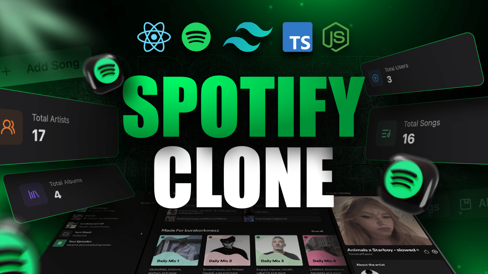

# SoundWave (MERN)

A full-stack **Spotify-like music streaming web app** built with the **MERN stack**, featuring:
- **Clerk** authentication (OAuth + session management)
- **Socket.IO** powered realtime chat & live updates
- **Shadcn/ui + Radix + Tailwind CSS** UI components
- **MongoDB + Mongoose** data persistence
- Media upload support (songs + album art) using **Cloudinary**

---

## 🎬 Preview

> A quick preview of the app UI and experience.




---

## 🚀 Tech Stack

- **Frontend:** React + TypeScript + Vite
- **Backend:** Node.js + Express
- **Database:** MongoDB (Mongoose)
- **Authentication:** Clerk (React + Express integration)
- **Realtime:** Socket.IO
- **UI:** Shadcn/ui + Tailwind CSS + Radix UI
- **Media Storage:** Cloudinary (image + audio uploads)

---

## ✅ Features

- User authentication / sign in via Clerk
- Realtime chat (live user presence + typing)
- Upload songs + album artwork
- Create / update / delete albums & songs (admin panel)
- Playback controls and music queue
- Analytics dashboard (total users, songs, albums)
- Responsive UI with modern components

---

## 🧱 Getting Started

### 1) Clone

```bash
git clone <repo-url> spotify-clone
cd spotify-clone
```

### 2) Backend Setup

```bash
cd Backend
npm install
```

Create a `.env` file in `Backend/` (or set env vars some other way):

```env
MONGO_URI=mongodb://localhost:27017/spotify_clone_db
# Optional: replace with your MongoDB Atlas URI
# CLERK_API_KEY=...
# CLERK_JWT_KEY=...
# CLOUDINARY_CLOUD_NAME=...
# CLOUDINARY_API_KEY=...
# CLOUDINARY_API_SECRET=...
```

> **Note:** The current Cloudinary config is hardcoded in `src/utils/Cloudinary.js`. For production, replace it with env variables.

Start the backend server:

```bash
npm run dev
```

Backend will run on: **http://localhost:3000**

### 3) Frontend Setup

```bash
cd ../Frontend
npm install
```

Create a `.env.local` (or use `src/.env.local`) for any runtime configuration (e.g., API base URL, Clerk publishable key, etc.).

Start the frontend server:

```bash
npm run dev
```

Frontend will run on: **http://localhost:5173**

---

## 🔧 Common Tasks

### Run the full app

From the repo root, open two terminals:

1. Backend:
   - `cd Backend && npm run dev`
2. Frontend:
   - `cd Frontend && npm run dev`

### Build Frontend

```bash
cd Frontend
npm run build
```

---

## 🗂️ Project Structure

- `Backend/` – Express API, Socket.IO, MongoDB models, routes, controllers
- `Frontend/` – React + TypeScript UI, routing, stores, components

---

## 🧩 Notes / Improvements


- **Seeds:** Add seed scripts to populate example albums/songs

---

## 📜 License

This project is provided as-is. Modify and reuse freely.
